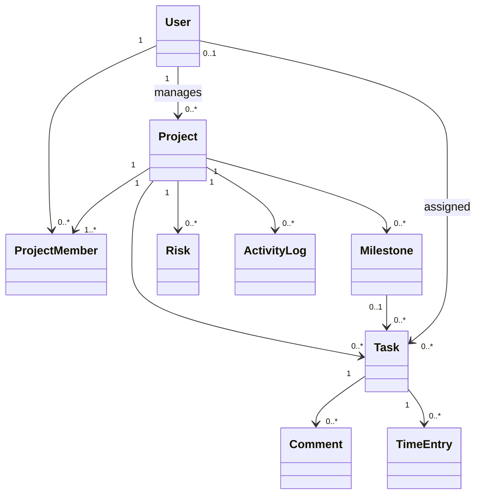

# ProjectFlow Project Management Service — Week 6 Design Specification

**Week:** 06  
**Status:** Approved capstone design  
**System:** ProjectFlow Project Management microservice  
**Runtime target:** Python 3.11 / FastAPI / Pydantic v2 / SQLAlchemy 2.x / MySQL 8

## 1. Business context
ProjectFlow is a fictional project-management platform used by a professional-services organisation running many client delivery projects at once. Teams currently track work across spreadsheets, chat, and email, which makes ownership, due dates, risks, effort, and progress difficult to see consistently.

The Week 6 capstone is to deliver a service that lets teams create projects, manage membership, plan milestones and tasks, enforce task workflow rules, capture risks/time/activity, and expose a project-health summary.

## 2. Core process
1. A project manager creates a project with a start/end date.
2. The creator is automatically registered as the project manager/member.
3. Additional users can be added as contributors or viewers.
4. Milestones and tasks are created inside the project.
5. Tasks are assigned only to project members and move through controlled statuses.
6. Contributors update tasks and log time/comments; risks can be recorded against the project.
7. The project summary calculates completion %, overdue tasks, open risks, and total hours.
8. Important writes create activity-log records for auditability.

## 3. Entity analysis

| Entity | Key attributes | Class or Function? Rationale |
|---|---|---|
| User | user_id, name, email, active, job_title | **Class.** A user has durable identity and participates in many projects. Authentication/lookup are services, but the user is a stateful domain record. |
| Project | project_id, name, manager_id, status, start_date, end_date | **Class.** A project has identity, lifecycle, ownership, dates, and relationships to many child records. It is the primary aggregate for Week 6. |
| ProjectMember | project_id, user_id, role, joined_at | **Class/association entity.** Membership contains business data such as role and join date, so it is richer than a simple many-to-many link. |
| Milestone | milestone_id, project_id, name, due_date, status | **Class.** A milestone is a named checkpoint with its own identity and completion state. |
| Task | task_id, project_id, milestone_id, assignee_id, status, due_date | **Class.** A task has identity and a controlled state machine. Transitions, assignment, and due-date rules are domain behaviour rather than stateless formatting. |
| Comment | comment_id, task_id, author_id, body, created_at | **Class.** A comment is an auditable collaboration record tied to a task and author. |
| TimeEntry | time_entry_id, task_id, user_id, hours, work_date | **Class.** A time entry records who spent how much effort on a task on a date, and is required for project effort reporting. |
| Risk | risk_id, project_id, title, probability, impact, status | **Class.** Risk has identity, ownership/state, and a calculable score. Risk scoring itself can be a method/function, while the risk is the durable entity. |
| ActivityLog | activity_id, project_id, actor_id, action, entity_type, entity_id | **Class.** Activity records provide append-only audit evidence of important changes. |

## 4. Aggregate and relationships
- `Project` is the primary aggregate root for project planning operations.
- `ProjectMember` controls which users may be assigned work or write within the project.
- `Task` belongs to a project and optionally a milestone.
- `Comment` and `TimeEntry` belong to tasks.
- `Risk` and `ActivityLog` belong directly to projects.

## 5. API contract

| Method | Path | Purpose | Success | Common errors |
|---|---|---|---|---|
| GET | `/v1/projects` | Paginated project list; filters for status/manager | 200 | 422 invalid query |
| POST | `/v1/projects` | Create project; creator becomes manager/member | 201 | 401/404/422 |
| GET | `/v1/projects/{id}` | Read one project | 200 | 404 |
| PATCH | `/v1/projects/{id}` | Manager updates project | 200 | 401/403/404/422 |
| DELETE | `/v1/projects/{id}` | Manager deletes project | 204 | 401/403/404 |
| POST | `/v1/projects/{id}/members` | Manager adds a user to project | 201 | 403/404/409/422 |
| GET | `/v1/projects/{id}/tasks` | List project tasks | 200 | 404 |
| POST | `/v1/projects/{id}/tasks` | Project member creates task | 201 | 403/404/422 |
| GET | `/v1/tasks/{id}` | Read one task | 200 | 404 |
| PATCH | `/v1/tasks/{id}` | Manager or assignee updates task | 200 | 403/404/422 |
| DELETE | `/v1/tasks/{id}` | Manager deletes task | 204 | 403/404 |
| GET | `/v1/projects/{id}/summary` | Project health/effort summary | 200 | 404 |

## 6. Authentication/RBAC teaching model
This capstone uses a deliberately simple `X-User-Id` request header instead of production OAuth/JWT. The dependency resolves the user from the database and produces `401` for a missing header and `404` for an unknown/inactive user.

Role rules:
- Project manager can update/delete the project, add members, and delete tasks.
- Any active project member can create a task.
- A task can be patched by the project manager or its current assignee.
- A task assignee must already be a member of the project.

## 7. Task state machine
Allowed transitions:
- `todo -> in_progress | blocked | cancelled`
- `in_progress -> blocked | done | cancelled`
- `blocked -> in_progress | cancelled`
- `done -> in_progress` (explicit reopen)
- `cancelled -> todo` (explicit restore)

A PATCH that attempts an illegal transition fails with `409 Conflict`.

## 8. Validation/business rules
- Project `end_date` cannot be before `start_date`.
- Project names are 3–120 characters.
- Task title is required; estimate must be positive if provided.
- Task due date must fall within project dates when a due date is provided.
- Task assignee must be a project member.
- Duplicate project membership is rejected with 409.
- PATCH uses `exclude_unset=True`; unknown fields are forbidden.
- Risk probability/impact are scored from 1–5; `score = probability * impact`.

## 9. Layering
1. **Route layer** — HTTP concerns, request parsing, dependency injection, response codes.
2. **Schema layer** — Pydantic validation/serialization.
3. **Service layer** — use-case orchestration, authorization decisions, business rules, transactions.
4. **Repository layer** — SQLAlchemy queries and persistence operations.
5. **ORM layer** — relational mappings.
6. **Pure domain layer** — framework-independent entities/state rules.

## 10. Persistence decisions
- SQLAlchemy 2.x annotated Declarative mappings (`Mapped`, `mapped_column`) are used.
- ORM querying uses `select()`/`Session` rather than legacy `Session.query()`.
- MySQL 8 is the target database; SQLite is used only for self-contained automated tests.
- `ProjectMember` has a composite uniqueness rule `(project_id, user_id)`.
- Important foreign keys use `ON DELETE CASCADE` where dependent history should disappear with a project/task in this teaching system.
- Alembic migration, `schema.sql`, `seed.sql`, and a `Base.metadata.create_all()` helper are supplied.

## 11. Project summary calculation
`GET /v1/projects/{id}/summary` returns:
- total tasks
- completed tasks
- blocked tasks
- overdue tasks
- completion percentage
- open risks
- total logged hours

Completion % is `completed / total * 100`; an empty project reports 0.0%.

## 12. Audit design
Project creation, project update, member addition, task creation, task update, and task deletion create `activity_logs` rows. Audit writing happens in the service layer inside the same DB transaction as the business change.

## 13. Error handling
- Missing/unknown user -> 401/404.
- Permission failure -> 403.
- Missing entity -> 404.
- Duplicate/conflicting state -> 409.
- Request validation -> 422.
- Unexpected errors are logged server-side and returned as a safe 500 message.

## 14. Definition of done — Week 6
- Domain/entity analysis completed before implementation.
- Project/member/task APIs implemented.
- RBAC rules enforced through dependency + service checks.
- Nested project-task APIs and summary endpoint implemented.
- MySQL schema and exactly 10 seed rows for every persisted table supplied.
- Happy-path and error-path tests supplied and passing.
- CI, Docker, Alembic, OpenAPI, SDD evidence, legacy refactor, and documentation included.
- Completed repository tagged `week-06`.
